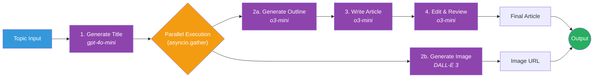
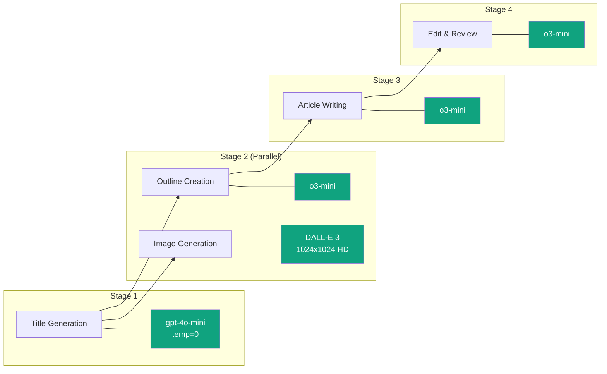

# ArticleAgent

**Automated Medium article generation powered by OpenAI and LangChain**

[](https://www.python.org/downloads/)
[](LICENSE)
[](https://www.langchain.com/)
[](https://openai.com/)

ArticleAgent is a Python-based automation tool that generates publication-ready Medium articles with accompanying professional images. It orchestrates multiple AI models through LangChain to handle title creation, outlining, writing, editing, and image generation — all from a single topic input.

---

## Architecture Overview

### System Architecture

```mermaid
graph TB
    subgraph User Interface
        CLI[CLI - argparse]
    end

    subgraph Orchestration Layer
        MAIN["main.py<br/>generate_article_process()"]
    end

    subgraph Prompt Templates
        PT1[WriteTitlePrompt]
        PT2[WriteOutlinePrompt]
        PT3[WriteArticlePrompt]
        PT4[EditArticlePrompt]
        PT5[GenerateImagePrompt]
    end

    subgraph LangChain Pipeline
        LC1["ChatOpenAI<br/>(gpt-4o-mini)"]
        LC2["ChatOpenAI<br/>(o3-mini)"]
        LC3["ChatOpenAI<br/>(o3-mini)"]
        LC4["ChatOpenAI<br/>(o3-mini)"]
        DALLE["OpenAI Images API<br/>(DALL-E 3)"]
    end

    subgraph Monitoring
        LS[LangSmith Tracing]
    end

    CLI -->|topic| MAIN
    MAIN --> PT1 --> LC1
    MAIN --> PT2 --> LC2
    MAIN --> PT3 --> LC3
    MAIN --> PT4 --> LC4
    MAIN --> PT5 --> DALLE
    MAIN -.->|@traceable| LS

    style CLI fill:#4A90D9,color:#fff
    style MAIN fill:#2C3E50,color:#fff
    style LS fill:#E67E22,color:#fff
    style DALLE fill:#10A37F,color:#fff
    style LC1 fill:#10A37F,color:#fff
    style LC2 fill:#10A37F,color:#fff
    style LC3 fill:#10A37F,color:#fff
    style LC4 fill:#10A37F,color:#fff
```

### Article Generation Pipeline

The pipeline follows a multi-stage process with parallel execution where possible:



### Data Flow Diagram

```mermaid
sequenceDiagram
    participant User
    participant Main as main.py
    participant Title as generate_title()
    participant Outline as generate_outline()
    participant Image as generate_article_image()
    participant Article as generate_article()
    participant Editor as edit_evaluate_article()
    participant OpenAI as OpenAI API

    User->>Main: topic
    Main->>Title: topic
    Title->>OpenAI: ChatOpenAI (gpt-4o-mini, temp=0)
    OpenAI-->>Title: title string
    Title-->>Main: title

    par Parallel Execution
        Main->>Outline: title
        Outline->>OpenAI: ChatOpenAI (o3-mini)
        OpenAI-->>Outline: structured outline
        Outline-->>Main: outline
    and
        Main->>Image: title
        Image->>OpenAI: DALL-E 3 (1024x1024 HD)
        OpenAI-->>Image: image URL
        Image-->>Main: image_url
    end

    Main->>Article: title + outline
    Article->>OpenAI: ChatOpenAI (o3-mini)
    OpenAI-->>Article: ~1000-word draft
    Article-->>Main: article_draft

    Main->>Editor: article_draft
    Editor->>OpenAI: ChatOpenAI (o3-mini)
    OpenAI-->>Editor: polished article
    Editor-->>Main: final_article

    Main-->>User: (final_article, image_url)
```

### Model Usage by Stage



---

## Features

- **Title Generation** -- Creates compelling, SEO-optimized titles (60 characters max) using GPT-4o-mini
- **Outline Creation** -- Develops structured outlines with introduction, main sections, conclusion, and call-to-action
- **Article Writing** -- Generates ~1,000-word markdown articles targeted at Engineering and IT decision-makers
- **Image Generation** -- Produces professional photo-realistic images via DALL-E 3 (1024x1024, HD quality)
- **Article Review & Editing** -- Automatic review for coherence, brevity, organization, and factual accuracy
- **Async Processing** -- Concurrent execution of outline and image generation via `asyncio.gather`
- **LangSmith Tracing** -- Full execution tracking and visualization for debugging and optimization

---

## Tech Stack

| Layer | Technology | Purpose |
|-------|-----------|---------|
| LLM Orchestration | LangChain 0.3 | Prompt chaining and LLM pipeline management |
| LLM Provider | OpenAI API | GPT-4o-mini, o3-mini, DALL-E 3 |
| Monitoring | LangSmith | Execution tracing, performance monitoring |
| Async Runtime | asyncio | Concurrent task execution |
| CLI | argparse | Command-line interface |
| Package Management | Poetry | Dependency management and virtual environments |

---

## Project Structure

```
ArticleAgent/
├── main.py                         # Entry point and pipeline orchestration
├── config.py                       # Configuration constants (LangSmith project name)
├── prompts/                        # LangChain prompt templates
│   ├── __init__.py
│   ├── WriteTitlePrompt.py         # Title generation prompt
│   ├── WriteOutlinePrompt.py       # Outline generation prompt
│   ├── WriteArticlePrompt.py       # Article writing prompt
│   ├── GenerateImagePrompt.py      # DALL-E image prompt
│   └── EditArticlePrompt.py        # Article review/editing prompt
├── pyproject.toml                  # Poetry dependencies and project metadata
├── poetry.lock                     # Locked dependency versions
├── LICENSE                         # MIT License
└── README.md
```

---

## Installation

### Prerequisites

- Python 3.11+
- [Poetry](https://python-poetry.org/docs/#installation) package manager
- OpenAI API key

### Setup

```bash
# Clone the repository
git clone https://github.com/espin086/ArticleAgent.git
cd ArticleAgent

# Install dependencies
poetry install

# Set required environment variables
export OPENAI_API_KEY='your-openai-api-key'

# Optional: Enable LangSmith tracing
export LANGSMITH_API_KEY='your-langsmith-api-key'
```

---

## Usage

Generate an article on any topic with a single command:

```bash
poetry run python main.py --topic "Your Topic Here"
```

### Example

```bash
poetry run python main.py --topic "The Future of Edge Computing in Enterprise Architecture"
```

This will:

1. Generate an SEO-optimized title
2. Create a structured outline and professional image in parallel
3. Write a ~1,000-word markdown article
4. Review and polish the article for publication quality
5. Output the final article text and image URL

---

## How It Works

### Pipeline Stages

| Stage | Function | Model | Description |
|-------|----------|-------|-------------|
| 1 | `generate_title()` | gpt-4o-mini (temp=0) | Creates a deterministic, SEO-optimized title |
| 2a | `generate_outline()` | o3-mini | Builds structured outline with sections and CTA |
| 2b | `generate_article_image()` | DALL-E 3 | Generates a photo-realistic companion image |
| 3 | `generate_article()` | o3-mini | Writes the full article from title + outline |
| 4 | `edit_evaluate_article()` | o3-mini | Reviews for coherence, brevity, accuracy |

Stages 2a and 2b run concurrently using `asyncio.gather()` for reduced latency.

### Prompt Engineering

Each stage uses a dedicated prompt template in the `prompts/` directory. Prompts are built with LangChain's `ChatPromptTemplate` and piped directly into the model using the `|` operator:

```python
chain = prompt | ChatOpenAI(model="o3-mini")
response = await chain.ainvoke({"topic": title})
```

### Monitoring

The main orchestration function is decorated with `@traceable` for LangSmith integration, providing visibility into token usage, latency, and execution flow across the entire pipeline.

---

## Configuration

| Variable | Required | Description |
|----------|----------|-------------|
| `OPENAI_API_KEY` | Yes | OpenAI API authentication key |
| `LANGSMITH_API_KEY` | No | Enables LangSmith tracing and monitoring |

Model selection and parameters can be adjusted directly in `main.py` function signatures.

---

## Contributing

Contributions are welcome. Please fork the repository and submit a pull request for any improvements or bug fixes.

---

## License

This project is licensed under the MIT License. See the [LICENSE](LICENSE) file for details.
